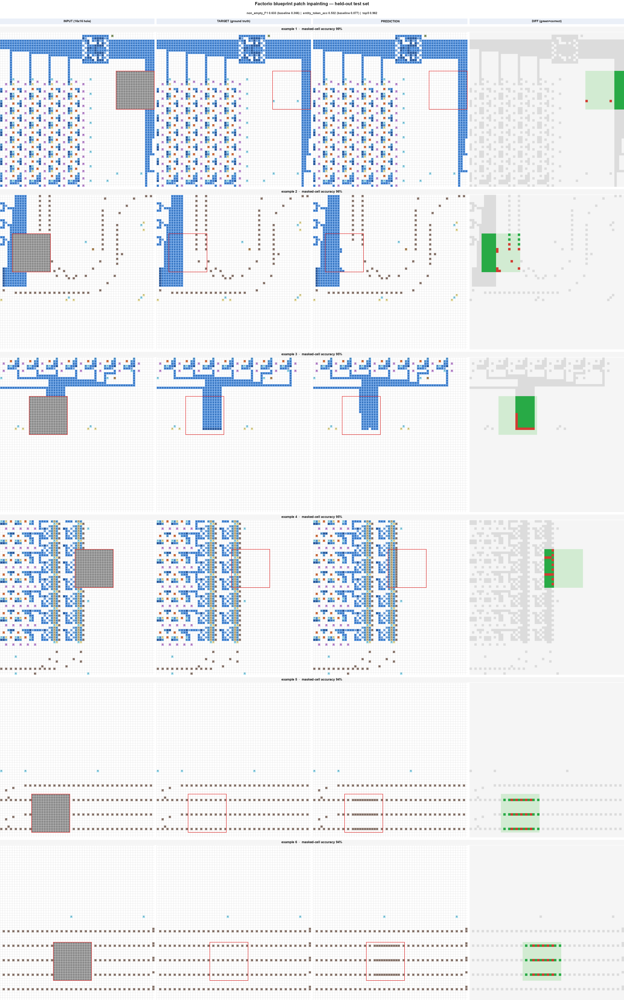

# Demo — Factorio blueprint patch inpainting

The model is shown a 64×64 crop of a real Factorio blueprint with a **16×16 hole**
(gray) and predicts the entities inside it. Below are examples from the **held-out
test set** (blueprints the model never saw during training).



**Each row, left → right:**

| Column | Meaning |
|---|---|
| **INPUT** | what the model sees — the gray square is the masked hole |
| **TARGET** | the real entities that were there |
| **PREDICTION** | what the model filled in (ground-truth context + predicted hole) |
| **DIFF** | inside the hole: **green = correct**, **red = wrong**, faint = correctly-empty |

Colors encode entity families (blue/red = belt tiers, dark-blue = undergrounds,
brown dots = electric poles, teal = pipes, purple = beacons, …); the little marks
are direction arrows. The model continues **belt lanes, electric-pole corridors,
and beacon grids straight through the hole** — it learned real spatial structure,
not a single token.

## Numbers (held-out test set, ~98k masked cells)

| Metric | **Model** | always-EMPTY | always-majority-entity |
|---|---:|---:|---:|
| non-empty **F1** (detection) | **0.633** | 0.000 | 0.366 |
| **entity-token accuracy** (exact name+direction) | **0.532** | 0.000 | 0.077 |
| **top-5** accuracy | **0.962** | — | — |
| masked-cell accuracy | 0.725 | 0.776 | 0.017 |

The model **beats both trivial baselines decisively** — exact entity-token accuracy
is ≈**6.9×** the majority baseline, and the true token is in its top-5 **96%** of the
time. (Raw `masked_acc` dips just below always-EMPTY because the model actually
places entities — the intended precision/recall tradeoff; raw accuracy was never the
goal here since ~78% of masked cells are empty.)

## Reproduce the demo

```bash
uv sync
# if you don't have a trained checkpoint yet, run the quickstart in README.md first
uv run python scripts/demo.py --checkpoint runs/poc_001/best.pt --out docs/demo --num 6
```

Full prediction galleries (input/target/prediction/diff per example) are written by
`uv run python -m factorio_patches.eval --checkpoint runs/poc_001/best.pt --split test`
to `outputs/demo_predictions/`. See [README.md](README.md) for the end-to-end
pipeline and [docs/findings.md](docs/findings.md) for the full write-up.
