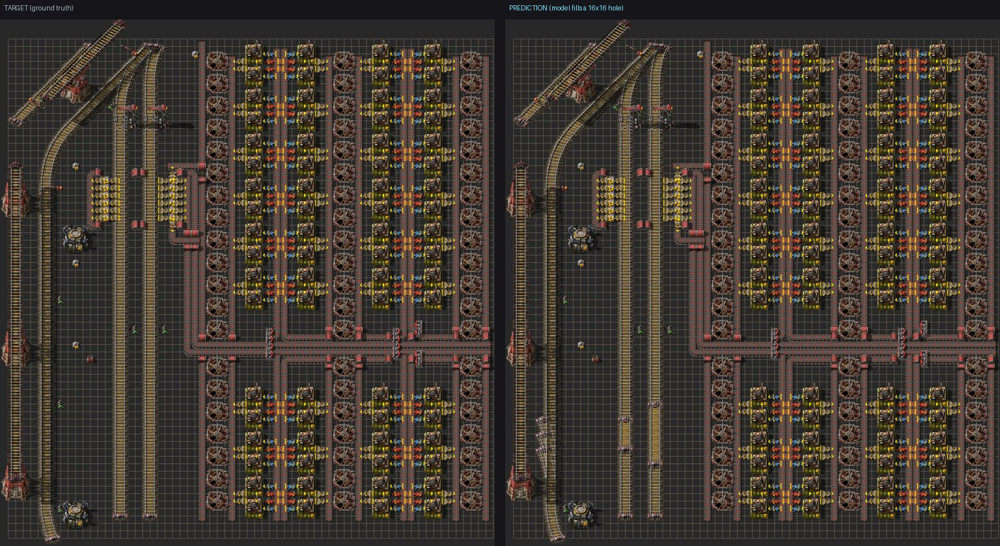

# factorio-patch-prediction

**Blueprint patch-inpainting for Factorio (native 2.0 + Space Age).** Take a real
blueprint, mask out a rectangular region, and predict the entities inside the hole —
like image inpainting, but over a 2D grid of Factorio entity tokens.

```
Given a 64×64 crop of a blueprint with a 16×16 region replaced by MASK,
predict the entity (name + direction + input/output) in every masked cell.
```

The repo runs the **whole pipeline end-to-end on real data**: it bulk-downloads
blueprints (FactorioPrints + FactorioBin), decodes/extracts them, **dedups and builds a
provably leak-free dataset**, rasterizes to token grids, trains models on a cloud GPU
(Modal, with wandb), and renders predictions back into **real Factorio graphics** (FBSR).

---

## Headline result

A compact **5.1M-param convolutional U-Net** reconstructs the masked region at
**0.550 exact entity accuracy / 0.952 top-5** on a held-out, **leak-free** test set of
native-2.0 + Space-Age blueprints (280-token vocab) — **~7× the majority baseline**.

This number is honest: the dataset removes exact *and* near-duplicate blueprints across
train/val/test (verified zero leakage), so it measures generalization, not memorization.



*The model fills the masked 16×16 region; predictions are exported to real Factorio 2.0
blueprint strings and rendered with FBSR. This is one of the higher-accuracy test examples —
the full **[interactive report](https://htmlpreview.github.io/?https://github.com/MrTsepa/factorio-patch-prediction/blob/main/docs/report.html)**
([`docs/report.html`](docs/report.html)) shows a gallery sampled evenly across the accuracy
distribution (not cherry-picked), each labeled with its accuracy and the exact predicted region outlined.*

## What we learned (the interesting part)

This started as a small POC and turned into a careful study. The findings:

- **A compact conv U-Net is the right tool — and it's the cheapest.** On identical
  leak-free data, **adding attention *hurts*** and **pure scale is a wash**:

  | architecture (~12M params unless noted) | test entity-acc |
  |---|---:|
  | **U-Net d96 (5.1M)** | **0.550** |
  | U-Net scaled (14M) | 0.544 |
  | U-Net + axial attention | 0.502 |
  | U-Net + bottleneck attention | 0.419 |
  | ViT transformer (patch-2) | 0.289 |

  The task is **cell-precise dense prediction**: top-5 is ~0.95 for all of them (they
  know *what* goes where), but exact placement is where the U-Net's full-resolution
  decoder wins. Attention adds capacity at the low-res bottleneck — the wrong place.

- **More data helps; bigger model doesn't.** Scaling the corpus 42× (255 → 10,764
  blueprints) lifted accuracy; scaling the model did not. The transformer *plateaued*
  even with 42× data — its gap is architectural (coarse patch decode), not data.

- **MaskGIT (iterative confidence decoding) rescues weak backbones but not the U-Net.**
  The decode gain is monotonic in backbone weakness — transformer **+0.105**
  (0.289 → 0.410), axial +0.062, scaled +0.015, **U-Net +0.010** (0.556 ≈ 0.550). A
  2×2 decomposition (training scheme × decoding) showed the *decoding* is the only
  upside, and only for models whose single-shot prediction is incoherent.

- **The eval is only as good as the split.** Naively splitting by *blueprint* leaks,
  because one book explodes into hundreds of near-identical blueprints; we split by
  connected-component **groups** (books sharing any blueprint) and bridge near-dups.

Full write-ups: [`docs/report_native_2.0.md`](docs/report_native_2.0.md),
[`docs/findings.md`](docs/findings.md). The script `scripts/build_report.py` produces a
self-contained HTML report (metrics + architecture comparison + FBSR game-render gallery).

## The data

- **Sources:** FactorioPrints (Firebase RTDB, ~4.4k native-2.0 strings incl. ~1.1k books)
  + FactorioBin Space-Age books.
- **Dedup:** a translation-invariant **entity-multiset hash** removed **42%** as duplicate
  *designs* (raw-string hashing misses re-encodes): 42,274 → **24,463 unique**.
- **Anti-leakage split:** connected-component grouping + near-dup bridging → train 7,534 /
  val 1,615 / test 1,615 with **zero** exact or ≥85%-similar blueprints across the boundary.
- Native **2.0 + Space Age**, 16-direction, vocab 280. Underground/loader **input↔output**
  is encoded in the token (a structural choice the model must predict, not derivable).

## Install

Uses [`uv`](https://docs.astral.sh/uv/):

```bash
uv sync          # .venv + torch + deps (Python 3.12)
uv run pytest    # unit tests
```

All commands run through `uv run`.

## Reproduce the pipeline

```bash
# 1. fetch native-2.0 blueprints from FactorioPrints (newest-first, concurrent, v2-filtered)
uv run python -m factorio_patches.download_factorioprints --keys 12000 --out data/raw/fprints20

# 2. decode -> extract+dedup+group -> vocab -> dataset.pt (one shot)
uv run python scripts/build_corpus.py --out-tag 5k --max-vocab 280

# 3. train (local). --arch {unet, unet-scaled, unet-attn, unet-axial, transformer};
#    --maskgit for variable-mask training + iterative-decode eval
uv run python -m factorio_patches.train --data data/processed/dataset5k.pt \
  --out runs/unet --arch unet --d-model 96 --epochs 120 --size-power 0.5 \
  --patience 10 --amp auto

# 4. build the HTML report (FBSR game-renders of predictions)
uv run python scripts/build_report.py --checkpoint runs/unet/best.pt \
  --data data/processed/dataset5k.pt --out outputs/report
```

### Cloud training (Modal)

`cloud/modal_train.py` runs multiple backbones in parallel on Modal GPUs (per-arch GPU,
bf16 AMP + `torch.compile`, early stopping with a wall-clock budget, wandb logging, unique
grouped run names):

```bash
uv run modal run cloud/modal_train.py                 # architecture comparison
uv run modal run cloud/modal_train.py --maskgit       # MaskGIT across backbones
uv run modal run cloud/modal_train.py --smoke --epochs 2 --samples 384   # quick validation
```

## Game-accurate rendering

Predictions are exported to real Factorio 2.0 blueprint strings and rendered with
[FBSR](https://github.com/demodude4u/Factorio-FBSR) (the engine FactorioBin uses), baked
from Factorio 2.0 + Space Age. The render path is validated against FactorioBin reference
images. See `scripts/fbsr.sh` and [`docs/findings.md`](docs/findings.md).

## Repo layout

```
src/factorio_patches/
  download_factorioprints.py / download_factoriobin.py   # bulk fetchers
  blueprint_decode.py        # string <-> JSON
  blueprint_extract.py       # books -> blueprints + extract_corpus (dedup + group)
  dedup.py                   # translation-invariant entity-multiset hashing
  vocab.py / rasterize.py    # tokens (name|dir|io) <-> int grids
  dataset.py                 # masked-patch dataset + anti-leakage group split + MaskGIT masking
  model.py                   # U-Net, UNet2D variants (scaled/attn/axial), ViT transformer
  metrics.py                 # masked metrics, baselines, maskgit_decode
  train.py / eval.py         # training loop (AMP/compile/early-stop/wandb), eval + blueprint export
  render.py / sprites.py     # abstract grid + sprite rendering
scripts/   build_corpus.py, build_report.py, build_html_demo.py, fbsr.sh, render_eval.py
cloud/     modal_train.py (Modal GPU training), Dockerfile, GCP/AWS/Nebius runbooks
docs/      report_native_2.0.md, findings.md
```

## Scope / limitations

- Models **entity anchors** (one cell/entity) — no multi-tile collision boxes; recipes,
  modules, circuit wires, fluids, trains are not modeled (token = name|direction|io).
- Predictions aren't validated in-engine; the blueprint export is structurally valid but
  not guaranteed playable.
- `~0.55` exact / `0.95` top-5 reflects genuine ambiguity (a hole often has many valid
  completions) plus the independent-softmax limitation (no joint coherence).

## Data provenance & politeness

Sources are public read APIs (FactorioPrints Firebase, FactorioBin). Downloaders send a
descriptive User-Agent, dedupe and cache on disk, and never re-fetch. Raw data, decoded
JSON, datasets, and checkpoints are **gitignored**. A sample HTML report + a render image
are included — game-rendered blueprints are widely shared in the Factorio community
(FactorioBin, FactorioPrints, r/factorio); the bulk of intermediate renders stay local.
