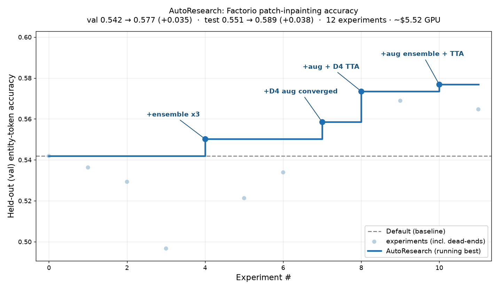

# AutoResearch: pushing patch-inpainting accuracy

An autonomous, [brain2qwerty](https://facebookresearch.github.io/brain2qwerty/)-style search that
*writes its own code/configs* (not just tunes a few hyper-parameters), runs training/eval
experiments, **searches on the held-out (val) split, confirms on test**, and greedily stacks the
discovered wins. Each dot below is one experiment; the step function is the cumulative best.



**Result: test entity-token accuracy 0.551 → 0.589 (+0.038, ≈ +7% relative)** for ~$5.5 of Modal
A10G GPU time (budget cap $10). All training/eval ran in the cloud — zero local compute.

## The trajectory (12 experiments, consistent n=10,000 eval)

| # | experiment | val | test | kept? |
|---|---|---|---|---|
| 0 | baseline U-Net (d96) | 0.542 | 0.551 | ✓ start |
| 1 | + D4 TTA (no aug) | 0.536 | 0.547 | ✗ *hurts* |
| 2 | + label smoothing | 0.529 | 0.538 | ✗ |
| 3 | U-Net axial-attention | 0.497 | 0.503 | ✗ |
| 4 | **ensemble ×3 (arch)** | 0.550 | 0.559 | ✓ **win** |
| 5 | D4 aug, 80 ep | 0.521 | 0.531 | ✗ *undertrained* |
| 6 | aug 80 ep + TTA | 0.534 | 0.546 | ✗ |
| 7 | **D4 aug, converged (139 ep)** | 0.559 | 0.570 | ✓ **win** |
| 8 | **aug + D4 TTA** | 0.574 | 0.587 | ✓ **win** |
| 9 | aug ensemble (long+big) | 0.569 | 0.580 | — |
| 10 | **aug ensemble + D4 TTA** 🏆 | **0.577** | **0.589** | ✓ **win** |
| 11 | aug + non-aug models + TTA | 0.565 | 0.577 | ✗ *dilutes TTA* |

## The key finding: augmentation and TTA are *non-additive — they compound*

Looked at in isolation, two of the levers are **losses**:

- **D4 test-time augmentation alone hurts** (exp 1: 0.551 → 0.547). Averaging a model's predictions
  over the 8 rotations/reflections of the grid only helps if the model is *equivariant*; a
  vanilla-trained model gives inconsistent answers across views, so the average is worse.
- **D4 training augmentation, undertrained, hurts** (exp 5: 0.531). 8× richer data slows
  convergence — at 80 epochs the aug model is *behind* the baseline.

But **train with D4 augmentation to convergence and the two levers unlock each other**:

- converged aug is a win on its own (exp 7: **0.570**, +0.019), and
- it makes the model approximately equivariant, so **TTA now *helps*** (exp 8: **0.587**) — the same
  operation that was a loss in exp 1.
- ensembling two independently-aug-trained models and applying TTA stacks once more (exp 10:
  **0.589**).

The mechanism check is exp 11: add the *non-aug* architecture models back into the TTA ensemble and
accuracy **drops** (0.589 → 0.577) — the non-equivariant members poison the view-averaging. So the
winning ensemble is *pure aug-trained models only*.

This interaction is exactly what a fixed hyper-parameter sweep misses: each lever, scored
independently, looks neutral-or-harmful; the gain only appears in a *specific stacked order*
(augment → converge → TTA → aug-ensemble).

## What didn't work (and why it's still informative)

- **Label smoothing** (0.538): softens the targets, which hurts an *exact-match* metric.
- **Axial attention** (0.503): attention hurts this cell-precise dense-prediction task — the
  convolutional inductive bias is the right one (consistent with the architecture study).
- **More capacity** (d128 aug, exp 9 is long+big): bigger ≠ better — scale is a wash here, the gain
  is from the *symmetry prior*, not parameters.

## Reproduce

```bash
# train the aug models on Modal (A10G)
uv run modal run cloud/modal_train.py::main --auto --epochs 140 --patience 12
# evaluate every config (ensembles + TTA) on the GPU, consistent n
uv run modal run cloud/modal_train.py::evals
# rebuild the ledger + plot
uv run python scripts/finalize_autoresearch.py /tmp/fulleval.log
uv run python scripts/plot_autoresearch.py --metric val_acc --out docs/renders/autoresearch.png
```

The D4 symmetry machinery (grid transforms + direction remap + TTA) is in
[`src/factorio_patches/symmetry.py`](../src/factorio_patches/symmetry.py); the ensemble/TTA scorer
is in [`src/factorio_patches/ensemble.py`](../src/factorio_patches/ensemble.py).
